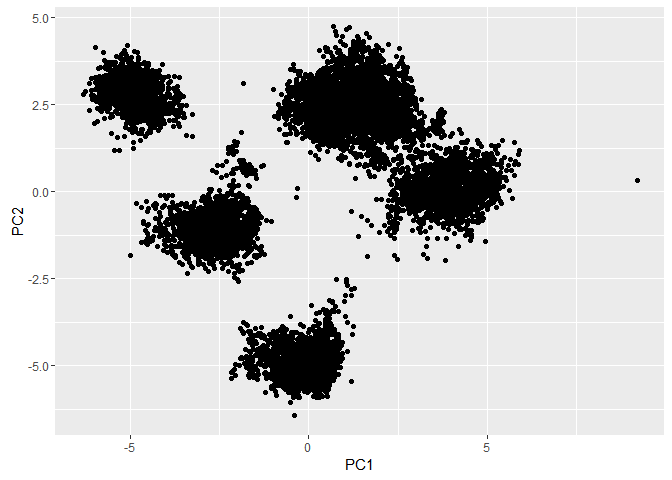
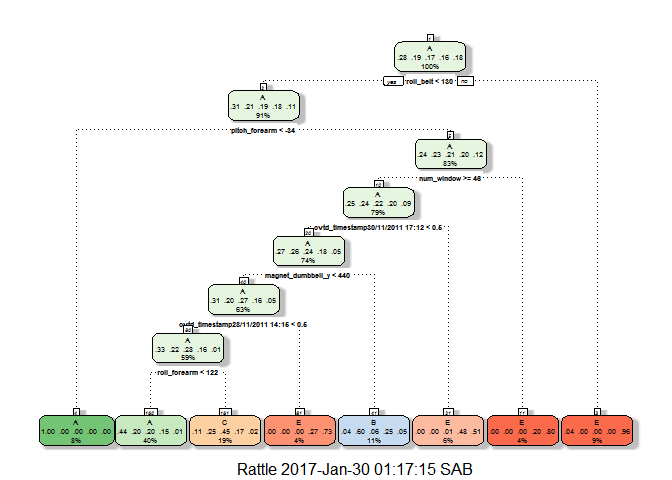
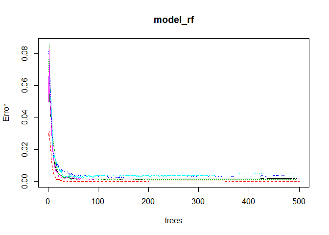

# Coursera Pratical Machine Learning Prediction Assignment
Ben  
January 29, 2017  

##Overview
This is my submission for the prediction assignment in the Coursera John Hopkins Practical Machine Learning course. The following analysis is to create a model designed to predict the manner in which they did the exercise. This analysis is using data from accelerometers on the belt, forearm, arm, and dumbell of 6 participants. The participants were asked to perform barbell lifts correctly and incorrectly in 5 different ways. This represents the classe variable in the dataset which will be the outcome variable in our models.


The goal of your project is to predict the manner in which they did the exercise. This is the "classe" variable in the training set. You may use any of the other variables to predict with. You should create a report describing how you built your model, how you used cross validation, what you think the expected out of sample error is, and why you made the choices you did. You will also use your prediction model to predict 20 different test cases.

###Loading data
First we will load the needed libraries along with data and then partition it.

```r
library(caret);library(randomForest);library(mice);library(doParallel);library(plyr);library(splines);library(gbm);library(cluster);library(klaR);library(rattle);library(rpart);library(dplyr)
training_original=read.csv("https://d396qusza40orc.cloudfront.net/predmachlearn/pml-training.csv",na.strings= c('#DIV/0!', '', 'NA'))
test_final=read.csv("https://d396qusza40orc.cloudfront.net/predmachlearn/pml-testing.csv",na.strings= c('#DIV/0!', '', 'NA'))
```

###Cleaning & partitioning data
The below code shows the proportion of NAs per column. This reveals there are a number of columns that only contain NAs. Furthermore, columns that contain NA are generally made up of mostly NAs. Therefore, first we will remove the columns completely made up of NAs plus the identity column.

```r
na_count<-data.frame(colMeans(is.na(training_original)))
colnames(na_count)[1] <- "NA_Percentage"
na_count$Variables<-rownames(na_count)
na_count<-data.frame(na_count[na_count$NA_Percentage>0,], row.names = NULL)
na_count<-na_count[with(na_count, order(-NA_Percentage)), ]
nrow(na_count[na_count$NA_Percentage>.8,]) # 100 variables where NAs make up over 80% of the data in the column.
```

```
## [1] 100
```

```r
drops <- c("X","max_yaw_belt","min_yaw_belt","max_yaw_dumbbell","min_yaw_dumbbell","max_yaw_forearm","min_yaw_forearm","kurtosis_yaw_belt","skewness_yaw_belt","amplitude_yaw_belt","kurtosis_yaw_dumbbell","skewness_yaw_dumbbell","amplitude_yaw_dumbbell","kurtosis_yaw_forearm","skewness_yaw_forearm","amplitude_yaw_forearm")
training_original<-training_original[ , !(names(training_original) %in% drops)]
```

Now how do we deal with NAs. As the NAs are high for columns with NAs we are just simply going to remove those columns.

```r
na_cols=colnames(training_original)[colSums(is.na(training_original)) > 0]
training_no_nas<-training_original[ , -which(names(training_original) %in% na_cols)]
```

Now we will partition the training data into training and test sets in order to do cross validaiton.

```r
intrain<-createDataPartition(y=training_original$classe,p=.6,list=FALSE)
training<-training_no_nas[intrain,]
test<-training_no_nas[-intrain,]
```

Running a principal component analysis (PCA) process to reduce dimensions through correlated variables will assist in increasing the perfomance of the model however we might see a reduction of accuracy. Therefore, we will run the model with and without PCA.

```r
#NAs removed
trainingpca<-preProcess(training, method = "pca", thresh = 0.95)
training_PCA <- predict(trainingpca, training)
testPCA <- predict(trainingpca,test)
```


###Decision Tree Models
The first set of models we will run is a set of decision trees. One using the variables, the other using PCA.

```r
#decision tree removed NAs
set.seed(123)
model_rpart<-train(classe~.,data=training,method="rpart")
pred_rpart<-predict(model_rpart,test)
confMat.pred_rpart<-confusionMatrix(test$classe,pred_rpart)
results_accuracy<-data.frame(confMat.pred_rpart$overall[1],row.names = NULL)
results_accuracy$Model<-'Decision tree'
colnames(results_accuracy)[1] <- "Accuracy"

#decision tree removed NAs using PCA inputs
set.seed(123)
model_rpart_pca<-train(classe~.,data=training_PCA,method="rpart")
pred_rpart_pca<-predict(model_rpart_pca,testPCA)
confMat.pred_rpart_pca<-confusionMatrix(test$classe,pred_rpart_pca)
results_accuracy_add<-data.frame(confMat.pred_rpart_pca$overall[1],row.names = NULL)
colnames(results_accuracy_add)[1] <- "Accuracy"
results_accuracy_add$Model<-'Decision tree - PCA'
results_accuracy<-rbind(results_accuracy,results_accuracy_add)
#results_accuracy
```

###Random Forest Models
The second set of models we will run is a set of random forests. One using the variables, the other using PCA.

```r
#random forest
set.seed(123)
model_rf<-randomForest(classe ~., data=training)
pred_rf<-predict(model_rf,test)
confMat.pred_rf<-confusionMatrix(test$classe,pred_rf)
results_accuracy_add<-data.frame(confMat.pred_rf$overall[1],row.names = NULL)
results_accuracy_add$Model<-'Random forest'
colnames(results_accuracy_add)[1] <- "Accuracy"
results_accuracy<-rbind(results_accuracy,results_accuracy_add)
#results_accuracy

#random forest using PCA inputs
set.seed(123)
model_rf_pca<-randomForest(classe ~., data=training_PCA)
pred_rf_pca<-predict(model_rf_pca,testPCA)
confMat.pred_rf_pca<-confusionMatrix(test$classe,pred_rf_pca)
results_accuracy_add<-data.frame(confMat.pred_rf_pca$overall[1],row.names = NULL)
results_accuracy_add$Model<-'Random forest - PCA'
colnames(results_accuracy_add)[1] <- "Accuracy"
results_accuracy<-rbind(results_accuracy,results_accuracy_add)
#results_accuracy
```


###Model selection
The model selection process was going to go further by looking at other models such as boosting models, linear discriminant analysis models and naive bayes models. However, this was halted because as the below table shows the accuracy score for cross validation clearly highlights random forests as being a highly accurate model. As the set of random forests models was the second set of models to be tested and provided great accuracy the model selection tests ceased. These tests could of continued however computing power was becoming an issue. As both random forests had the same accuracy score therefore the first Random forest model was selected as it doesn't rely on  conversion of data in dimension reduction.

```r
results_accuracy<-results_accuracy[order(results_accuracy$Accuracy, decreasing = TRUE),c("Model","Accuracy")]
results_accuracy
```

```
##                 Model  Accuracy
## 3       Random forest 0.9985980
## 4 Random forest - PCA 0.9854703
## 2 Decision tree - PCA 0.6209534
## 1       Decision tree 0.5768544
```

###Model use on test set
Now we will use this random forest model on the test set. However first we have to do some data cleaning and converting of classes.

```r
test_names<-names(training[, -59])
test_oos<-test_final[ , which(names(test_final) %in% test_names)]
num_names=colnames(select_if(training, is.numeric))   
test_oos[,num_names] = apply(test_oos[,num_names], 2, function(x) as.numeric(as.character(x)))
num_names=colnames(select_if(training, is.factor))   
test_oos[,names(test_oos) %in% num_names] = apply(test_oos[,names(test_oos) %in% num_names], 2, function(x) as.factor(as.character(x)))
num_names=colnames(select_if(training, is.integer))   
test_oos[,num_names] = apply(test_oos[,num_names], 2, function(x) as.integer(as.character(x)))
test_oos <- rbind(training[700, -59] , test_oos)
test_oos <-test_oos[-1,]
```

This is the final prediction on the new data:

```r
pred_test_final<-predict(model_rf,test_oos, type = "class")
pred_test_final
```

```
##  1  2  3  4  5  6  7  8  9 10 11 12 13 14 15 16 17 18 19 20 
##  B  A  B  A  A  E  D  B  A  A  B  C  B  A  E  E  A  B  B  B 
## Levels: A B C D E
```

###Out of sample error
Out of sample error as stated in the lecture slides is the error rate you get from new data. Data outside what the model is trained on. This is calcuated by measuring the accuracy of your models predictions against data which was not used to build it. As illustrated below the random forest model has an out of sample error rate of less than 1%. Very good.

```r
1-results_accuracy$Accuracy[1]
```

```
## [1] 0.001401988
```


##Appendix
Here are a number of plots I examined whilst doing this analysis.

```r
qplot(x= PC1, y= PC2, data = training_PCA)
```

<!-- -->

```r
fancyRpartPlot(model_rpart$finalModel)
```

<!-- -->

```r
plot(model_rf)
```

<!-- -->
